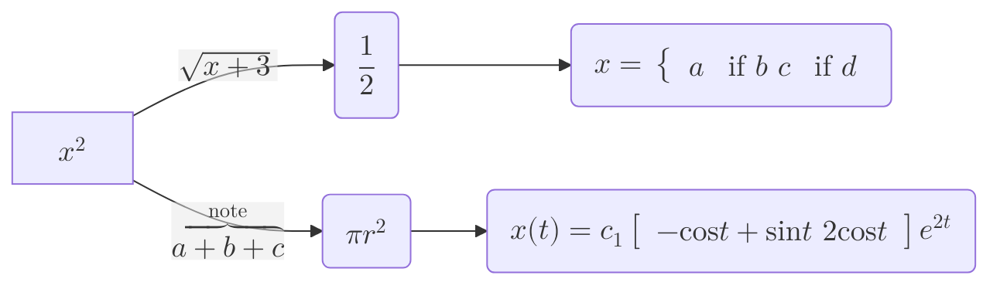

Bonjoura aaa cc Je suis une poire

Comment 

$$
\int_{x=0}^8 f(x) \mathrm d x
$$

```c
#include <stdio.h>
#include <stdlib.h>

void main() {
    puts("Hello world!");
    return EXIT_SUCCESS;
}
```


| foo | bar |
| --- | --- |
| baz | bim |

> ### NOTE
> Useful information that users should know, even when skimming content.
{: .info }



